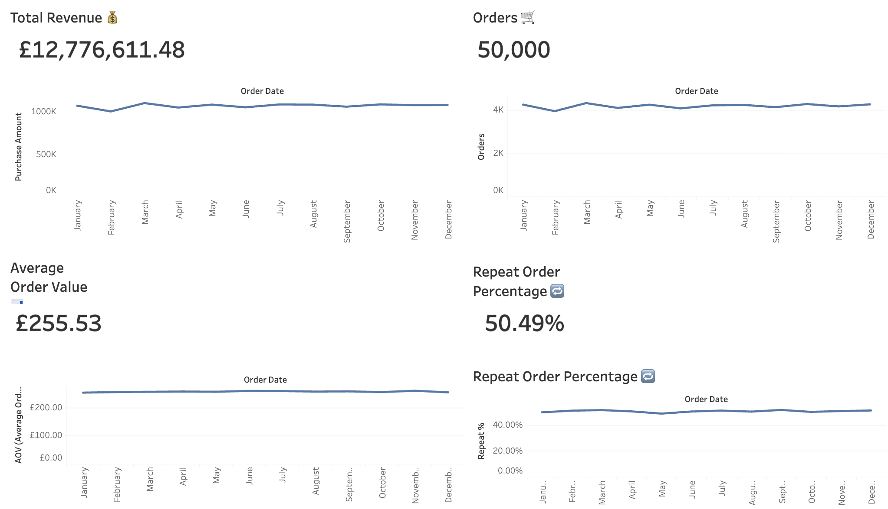
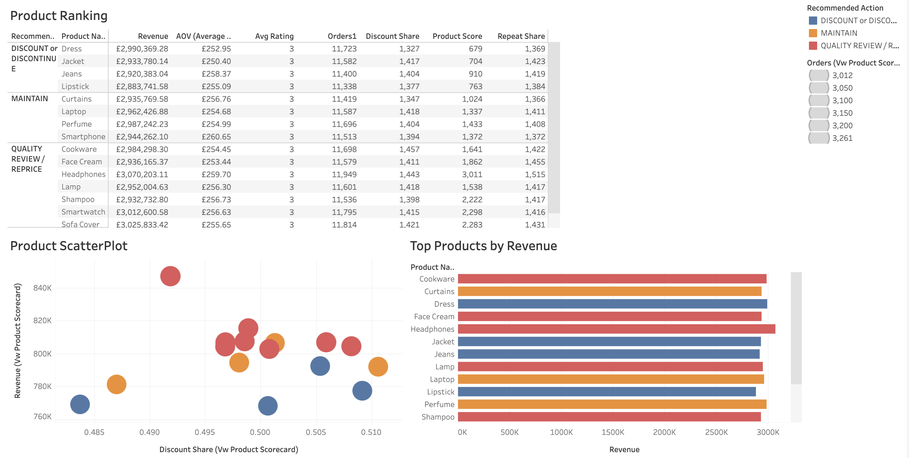
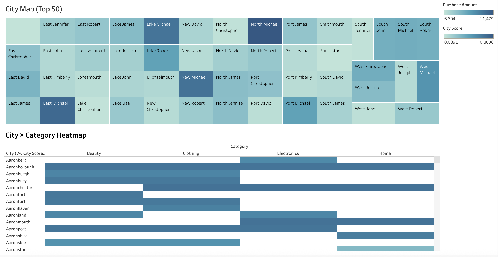
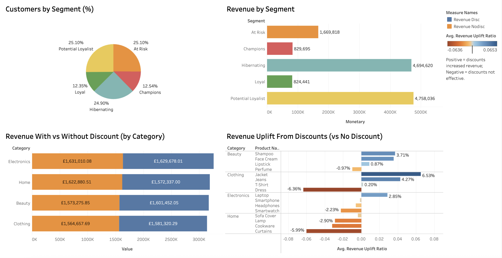

# Walmart Customer Purchase Behavior Analysis (SQL + Tableau)

## 🔍 Project Overview
This project analyzes **Walmart customer purchase behavior** using **PostgreSQL (SQL)** for data modeling and KPIs, and **Tableau** for interactive dashboards.  
The goal is to identify high-value customers, top-performing products, and effective promotional strategies to help optimize Walmart’s sales and marketing decisions. This project is for educational purposes only and is based on a Kaggle dataset that simulates Walmart sales, designed to best reflect real-world retail behavior.
---

## 🎯 Business Problem
Walmart generates massive sales data across products and cities, but not all products and campaigns are equally effective in the market.  
Key questions we wanted to answer:
- Which products should Walmart **promote, maintain, or discontinue**?  
- Which **cities** contribute the most revenue and repeat customers?  
- Which **customer segments** (via RFM analysis) are loyal vs at risk?  
- Do **discounts actually increase sales**, or do they just cut margins? 
---

## 🛠️ Tech Stack
- **SQL (PostgreSQL)** → Data cleaning, modeling, KPIs, and scorecards  
- **Tableau** → Interactive dashboards for visualization  
- **GitHub** → Version control and portfolio showcase
---

## 🗂️ Repository Structure
code_main/
│── 01_load_csv.sql # Load raw data into staging
│── 02_data_model.sql # Create dimensions + fact tables
│── 03_kpis.sql # Core KPIs (revenue, AOV, repeat %)
│── 05_scorecards.sql # Product & city scorecards with actions
│── 06_discount_effectiveness.sql# Discount vs no-discount analysis
│── 07_tableau_view.sql # Final wide view for Tableau
│── 08_checks.sql # Sanity checks (row counts, nulls)
screenshots/
│── kpis.png
│── product_scorecard.png
│── city_scorecard.png
│── customer_segments.png
README.md
---

## 📊 Tableau Dashboard (Live)
👉 [View Interactive Dashboard on Tableau Public](https://public.tableau.com/app/profile/suvayan.rakshit/viz/WalmartCustomerPurchaseBehaviorAnalysis/KPIs)

Dashboards included:
1. **KPIs Overview** – Revenue, Orders, AOV, Repeat %  
2. **Product Scorecard** – Which products to promote, maintain, or discontinue  
3. **City Scorecard** – High vs low performing cities  
4. **Customer Segmentation (RFM)** – Champions, Loyal, At Risk, Hibernating  
5. **Discount Effectiveness** – Impact of discounts on sales uplift  
---

## 📸 Screenshots

### KPI Overview

### Product Scorecard

### City Scorecard

### Customer Segmentation

---

## ✅ Key Insights  

- **High-revenue, low-discount products emerged as clear growth drivers.**  

  These products consistently generate strong sales without relying on promotions, making them ideal candidates for **promotion campaigns, restocking priority, and cross-selling opportunities**. By focusing resources here, Walmart can maximize revenue with minimal margin erosion.  

- **Discount-dependent products are not always profitable.**  

  Several products showed high reliance on discounts but still failed to deliver meaningful sales volume. These items should be considered for **repricing strategies, quality reviews, or eventual discontinuation**, as they tie up inventory and reduce profitability without clear long-term value.  

- **City-level analysis revealed concentrated performance gaps.**  

  Certain cities significantly outperformed others in terms of revenue and repeat customers. By doubling down on **supply chain efficiency, inventory allocation, and targeted local marketing** in these cities, Walmart can amplify growth while identifying underperforming regions that may require revised strategies.  

- **Customer segmentation identified Champions and Loyal buyers as the core of repeat revenue.**  

  These segments are Walmart’s most valuable customers and in my opinion, should be pushed further through **personalized offers, loyalty rewards, and retention campaigns**. On the other hand, **At Risk and Hibernating segments** provide opportunities for **reactivation strategies** like targeted discounts or engagement campaigns.  

- **Discount effectiveness analysis proved that promotions are not universally beneficial.**  

  In some categories, discounts generated only marginal uplift in orders, meaning Walmart effectively sacrificed margin without a meaningful increase in volume. Strategic, data-driven discounting can help the business **avoid unnecessary margin leakage** while still using promotions to drive sales where they are proven effective.  
---

## 👤 Author
**Suvayan Rakshit**  
- 🌐 [Portfolio](https://github.com/SuvayanR07)  
- 💼 [LinkedIn](https://linkedin.com/in/suvayanrakshit)  
- 📊 [Tableau Public](https://public.tableau.com/app/profile/suvayan.rakshit)  
---
